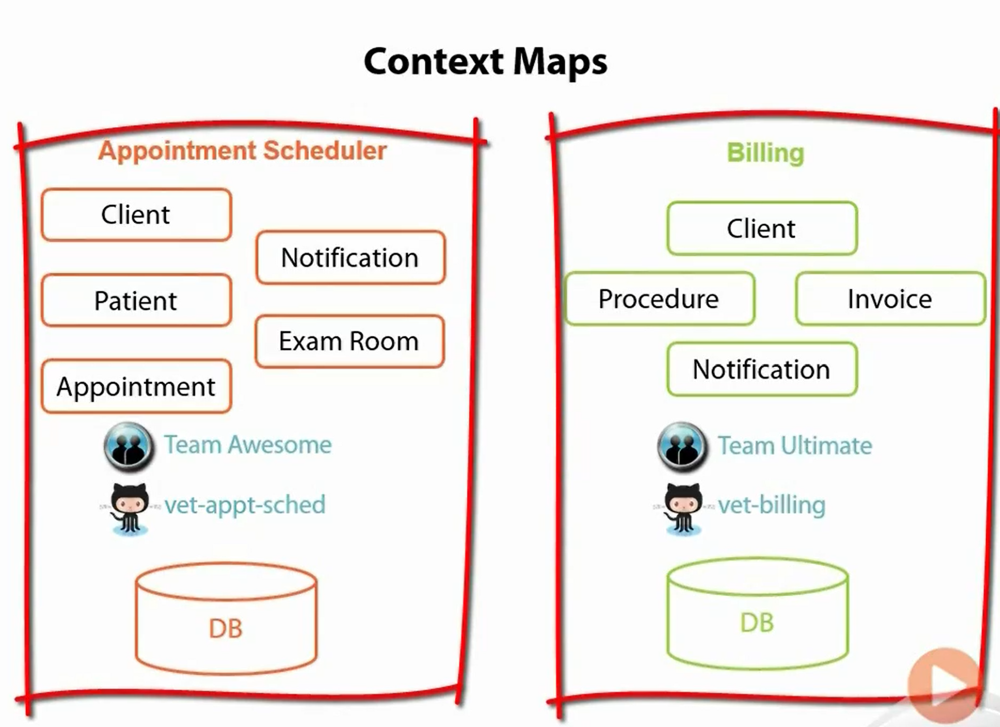
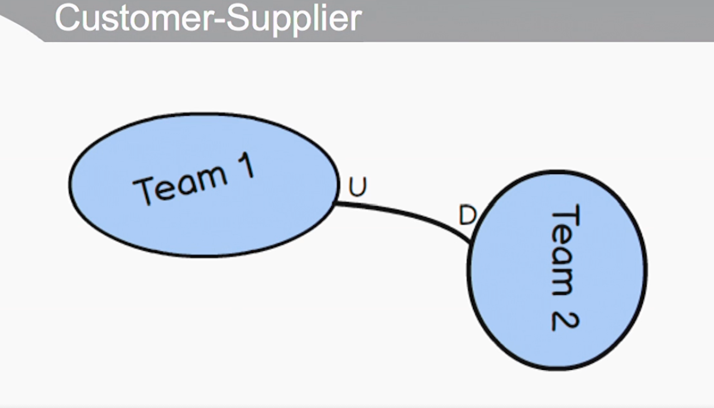
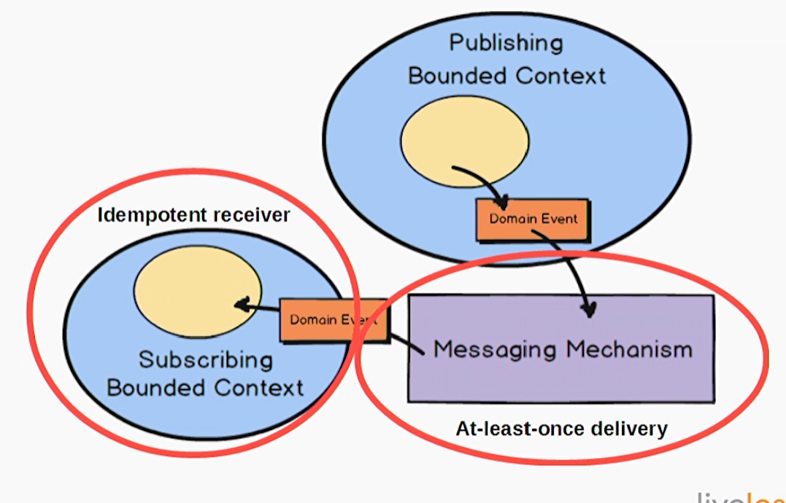

<!-- vscode-markdown-toc -->
* 1. [DDD vs Clean Architecture](#DDDvsCleanArchitecture)
* 2. [Command Query Segregation](#CommandQuerySegregation)
* 3. [ 3. Domain-Driven Design Fundamentals](#3.Domain-DrivenDesignFundamentals)
	* 3.1. [DDD: Modeling Problems in Software](#DDD:ModelingProblemsinSoftware)
		* 3.1.1. [Value Objects](#ValueObjects)
		* 3.1.2. [Bounded Context](#BoundedContext)
		* 3.1.3. [SubDomain vs Bounded Context](#SubDomainvsBoundedContext)
		* 3.1.4. [Context Maps](#ContextMaps)
		* 3.1.5. [Our Bounded Contexts for this App](#OurBoundedContextsforthisApp)
		* 3.1.6. [Ubiquitous Language](#UbiquitousLanguage)
		* 3.1.7. [Terms](#Terms)
	* 3.2. [Elements of a Domain Model](#ElementsofaDomainModel)
		* 3.2.1. [Focus on the Domain](#FocusontheDomain)
		* 3.2.2. [Anemic and Rich Models](#AnemicandRichModels)
		* 3.2.3. [Entities in DDD and in Our Bounded Context](#EntitiesinDDDandinOurBoundedContext)
		* 3.2.4. [Entities & Single Responsibility Principle](#EntitiesSingleResponsibilityPrinciple)
		* 3.2.5. [Should Entities Have Equality Comparers?](#ShouldEntitiesHaveEqualityComparers)
		* 3.2.6. [Implementing Entities of Code](#ImplementingEntitiesofCode)
		* 3.2.7. [Associations (aka relationships)](#Associationsakarelationships)
		* 3.2.8. [Value Objects](#ValueObjects-1)
		* 3.2.9. [Value Objects in Code](#ValueObjectsinCode)
		* 3.2.10. [Entity Logic in Value Objects](#EntityLogicinValueObjects)
		* 3.2.11. [Domain Services](#DomainServices)
		* 3.2.12. [Glossary](#Glossary)
	* 3.3. [Aggregates in Domain-Driven Design](#AggregatesinDomain-DrivenDesign)
		* 3.3.1. [Tackling Data Complexity](#TacklingDataComplexity)
		* 3.3.2. [Aggregates](#Aggregates)
		* 3.3.3. [Interacting with Aggregates](#InteractingwithAggregates)
		* 3.3.4. [Using Invariants](#UsingInvariants)
		* 3.3.5. [Modeling Breakthroughs and Refactoring](#ModelingBreakthroughsandRefactoring)
		* 3.3.6. [Aggregate Tips](#AggregateTips)
		* 3.3.7. [Glossary](#Glossary-1)
	* 3.4. [Repositories](#Repositories)
		* 3.4.1. [Tips](#Tips)
		* 3.4.2. [Repositories vs Factories](#RepositoriesvsFactories)
		* 3.4.3. [Using a Generic Repository Interface](#UsingaGenericRepositoryInterface)
		* 3.4.4. [Generic Repositories in DDD](#GenericRepositoriesinDDD)
		* 3.4.5. [Repositories in this Application](#RepositoriesinthisApplication)
		* 3.4.6. [Glossary](#Glossary-1)
	* 3.5. [AntiCorruption Layer and Domain Events](#AntiCorruptionLayerandDomainEvents)
		* 3.5.1. [Anti-Corruption Layer](#Anti-CorruptionLayer)
		* 3.5.2. [Glossary](#Glossary-1)
* 4. [Domain Driven Design Distilled](#DomainDrivenDesignDistilled)
	* 4.1. [Lession 1: DDD for Me](#Lession1:DDDforMe)
		* 4.1.1. [Good, Bad, and Effective Design](#GoodBadandEffectiveDesign)
		* 4.1.2. [Strategic Design](#StrategicDesign)
		* 4.1.3. [Tactical Design](#TacticalDesign)
	* 4.2. [Strategic Design with Bounded Contexts and the Ubiquitious Language](#StrategicDesignwithBoundedContextsandtheUbiquitiousLanguage)
		* 4.2.1. [Introduction](#Introduction)
		* 4.2.2. [Domain Experts and Business Drivers](#DomainExpertsandBusinessDrivers)
		* 4.2.3. [Case Study](#CaseStudy)
		* 4.2.4. [Fundamental Strategic Design Needed](#FundamentalStrategicDesignNeeded)
		* 4.2.5. [Challenge and Unify](#ChallengeandUnify)
		* 4.2.6. [Architecture](#Architecture)
	* 4.3. [Strategic Design with Subdomains](#StrategicDesignwithSubdomains)
		* 4.3.1. [What Is a Subdomain?](#WhatIsaSubdomain)
		* 4.3.2. [Types of Subdomains](#TypesofSubdomains)
		* 4.3.3. [Dealing With Complexity](#DealingWithComplexity)
	* 4.4. [Strategic Design With Context Mapping](#StrategicDesignWithContextMapping)
		* 4.4.1. [Partnership](#Partnership)
		* 4.4.2. [Shared Kernel](#SharedKernel)
		* 4.4.3. [Customer-Supplier](#Customer-Supplier)
		* 4.4.4. [Conformist](#Conformist)
		* 4.4.5. [Anti-corruption Layer](#Anti-corruptionLayer)
		* 4.4.6. [Open Host Service](#OpenHostService)
		* 4.4.7. [Published Language](#PublishedLanguage)
		* 4.4.8. [Separate Ways](#SeparateWays)
		* 4.4.9. [Big Ball of Mud](#BigBallofMud)
		* 4.4.10. [Making Good Use of Context Mapping](#MakingGoodUseofContextMapping)
	* 4.5. [Tatical Design With Aggregates](#TaticalDesignWithAggregates)

<!-- vscode-markdown-toc-config
	numbering=true
	autoSave=true
	/vscode-markdown-toc-config -->
<!-- /vscode-markdown-toc -->

##  1. <a name='DDDvsCleanArchitecture'></a>DDD vs Clean Architecture

- https://khalilstemmler.com/articles/software-design-architecture/domain-driven-design-vs-clean-architecture/

##  2. <a name='CommandQuerySegregation'></a>Command Query Segregation

- https://khalilstemmler.com/articles/oop-design-principles/command-query-segregation/

- A *method* is either a `COMMAND` (which performs an action) OR a `QUERY` (that returns data to the caller), but never both
    - `Asking a question shouldn't change the answer`

##  3. <a name='3.Domain-DrivenDesignFundamentals'></a> 3. Domain-Driven Design Fundamentals

- Pluralsight, `Domain-Driven Design Fundamentals`
- Domain driven design is useful when you have a `complex business domain` not `technical complexity`


###  3.1. <a name='DDD:ModelingProblemsinSoftware'></a>DDD: Modeling Problems in Software

####  3.1.1. <a name='ValueObjects'></a>Value Objects

####  3.1.2. <a name='BoundedContext'></a>Bounded Context

- Each bounded context should have it's own team, codebase, and database schema


- Models mean different things in different contexts
- For example, it wouldn't make sense to stop a client from scheduling an appointment if they didn't have a credit card on file yet


- If you have multiple contexts you'll want to keep them bounded
    - One way to do this is to keep team members, data, and code separate from one another
    - Rarely seen in real world
    - Having concept in mind helps keep the idea of separation in mind


####  3.1.3. <a name='SubDomainvsBoundedContext'></a>SubDomain vs Bounded Context

- Subdomain is a problem space concept
- Bounded context is a solution space concept
- Ideally a subdomain would live within a single bounded context cleanly

```
A subdomain is a part of your business. There are core domains, supporting domains and generic domains. Core domains are where the money is, supporting domains support your core business, and generic domains are the ones you need, but don't care a lot about, so you would probably buy them of the shelf. For an insurance company, the core domain is insurance, a supporting domain could be client portfolio, and a generic domain could be something like timesheets.
```

- Think of a floor with carpeting - those are two distinct things
    - The bounded context is the carpeting that had been shapped to fit the flooring (the subdomain)

####  3.1.4. <a name='ContextMaps'></a>Context Maps

- If an organization has multibounded contexts (ideally separated), there may be confusion when the different teams are talking to one another
- `Context Maps` to visualize and demonstrate to the teams where their boundaries lie
- Common for one team to handle multiple bounded contexts that reside in a single app and with one data source


- Part of creating a context map involves explicitly defining each bounded context's boundary

<br>

- Nonideal case


- Ideal case



- How do you share cross cutting concerns between these apps like authentication?
    - `Shared Kernel`


####  3.1.5. <a name='OurBoundedContextsforthisApp'></a>Our Bounded Contexts for this App

- Because these two teams share `Authentication` now, they agree to not change it without discussing with the other team first


- Note here that there are several contexts within the same application which is why the solution is set up the way that it is


####  3.1.6. <a name='UbiquitousLanguage'></a>Ubiquitous Language

- Effective communication among all stakeholders is key to a successful initiative
- One of the fundamental processes
- Developers and business partners should speak the same language - no translation should be necessary
- Good practice is to explain back to business partners what you think the system should do in terms of the domain
- For a single bounded context the ubiquitous language should be used throughout that context - from conversations to design documents to whiteboarding to emails to code - literally everywhere

####  3.1.7. <a name='Terms'></a>Terms

- `Problem Domain` - The specific probelm the software you're working on is trying to solve
- `Core Domain` - the key differentiator for the customer's business - something you must do well and cannot oursource
- `SubDomain` - separate applications or features your software must support or interact with
- `Bounded Context` - a specific responsibility, with explicit boundaries that separate it from other parts of the system
    - *Within the context of appointment scheduling, this is what a client looks like*
    - *Within the context of billing, this is what a client looks like*
- `Context Mapping` - the process of identifying bounded contexts and their relationships to one another
- `Shared Kernel` - part of the model that is shared by two or more teams, who agree not to change it without collaboration
    - Authentication
- `Ubiquitous Language` - a language usig terms from the domain model that programmers and domain experts use to discuss the system
    - This is what allows us to be precise within the domain
    - `SchedulingApp.Client` vs `Billing.Client`

<br>

- Common for something like `Customer` to become a god object that everyone in your organization uses but applications really only want a tiny subset of that object for its own use

###  3.2. <a name='ElementsofaDomainModel'></a>Elements of a Domain Model

####  3.2.1. <a name='FocusontheDomain'></a>Focus on the Domain

- Not the user interaction
- Not the data access

```
The Domain Layer is responsible for representing concepts of business, information about the business situation, and business rules. State that relects the business situation is controlled and used here, even though the technical details of storing it are delegated to the infrastructure. *This layer is the heart of business software*
```

- Focus on the domain not the technical details of how the software will function
- Focus on the behaviors within the domain not attributes
    - Schedule an appointment for a checkup
    - Note a pet's weight
    - Request lab work
    - Notify pet owners of vaccinations due
    - Accept a new patient
    - Book a room

####  3.2.2. <a name='AnemicandRichModels'></a>Anemic and Rich Models

- In DDD, models that simply have getters/setters are considered `anemic` and are an anti-pattern
- The domain models should contain the behaviors of the domain

####  3.2.3. <a name='EntitiesinDDDandinOurBoundedContext'></a>Entities in DDD and in Our Bounded Context

- Entities have identity and are mutable


- Appointment is the main entity here and it extendeds from a base class called entity which assigns an guid (no database required)


- The other entities in this context are simple crud (not DDD) classes in this context - they don't have complex business rules and it's easy just to have the database assign the int (the id)

<br>

- Using a unique ID for appointment allows us to retrieve, track, and edit an appointment even if some of its values change
- The other classes here needed to be retrieved but not editing is required


- Notice here that terms like `ClientView`, `ClientDetails` are not used
- We just use `Client` and know what it means because of the context in which we are speaking about it


####  3.2.4. <a name='EntitiesSingleResponsibilityPrinciple'></a>Entities & Single Responsibility Principle

- Does having a lot of business logic in an entity violate SRP?
- An entity should't have a lot of business logic in it - otherwise as you build out your system, you have to put more and more into the class
- Entities should be responsible for identity and lifecycle
- identity isn't always just an id field
    - This might work where you have something like a UPS package where you have a tracking number for the id that is with it from beginning to end
- If you're trying to identify a customer - you might need their name, address, some other secret information
- Sometimes identity can be so complex you need another object or set of objects to help the entity handle identification
- Lifecycle can be something like a UPS package where it can be `in transit`, `shipped`, `received`, etc
    - If there is a lot of logic around updating/handling the lifecycle, you may want some other services to help with this
    - Entity may also delegate to a value object

####  3.2.5. <a name='ShouldEntitiesHaveEqualityComparers'></a>Should Entities Have Equality Comparers?

- Need to take the cases individually - determing if entities are equal, it can be nontrivial

####  3.2.6. <a name='ImplementingEntitiesofCode'></a>Implementing Entities of Code

- Use static factory methods to help avoid entities being in an *inconsistent state*


####  3.2.7. <a name='Associationsakarelationships'></a>Associations (aka relationships)

- Typically we think of relationships bidirectionally


- Bidirectional relationships can make things more complex

- Domain driven design pushes towards one way relationships
    - You can have them but it is extra complexity
- If you have a bidirectional relationship, neither can be defined without the other
    - `Is a Client without a Patient still a Client?`
    - `Is a Patient without a Client still a Patient?`


- Start with one-way relationships
    - A client needs a patient to schedule a patient
    - A client would not need a patient to pay a bill
    - A patient (an animal) doesn't schedule an appointment
    - A patient (an animal) doesn't pay a bill


- After this investigation, it only makes sense for `Client` to have `Patients` in the `Appointment Scheduling Bounded Context`


####  3.2.8. <a name='ValueObjects-1'></a>Value Objects

- Play equally important role as entity object
- It measures, quantifies, or describes a thing in the domain
- Identity is based on the composition of alues
- Immutable - once the instance is created, you'd never change the values
- Compared using all values
- No side effects
    - Should only compute things
    - Should not change state of itself or the system

<br>

- A string is a great example of a value object
- The contents of the string is what gives that thing meaning
- Say the string is `CAR`
    - Changing the `R` -> `T` to be `CAT` gives the string very different meaning even though it'd technically be the same object

<br>

- Money is a great value object
- If a company is worth $USD 50,000,000


- A good example of a value object inside of our domain is the start and end time for the appointment, you need them together 


- We should strive to have entities which have very few primitives themselves and instead are made up of value objects
- Try starting with looking at it from the perspective of should it be a value object
- Do certain properties always go together? Maybe that's a good case for a value object

<br>

- From Eric Evans, value objects are a really good place to put methods and logic
    - Better place than entities


- Value objects don't make sense on their own


####  3.2.9. <a name='ValueObjectsinCode'></a>Value Objects in Code

- Private setters
- User can't set/update state once object is created
- `NewEnd`, `NewDuration`, `NewStart` return a new `DateTimeRange`


- In the `AnimalType` example, there's not much logic but it gives us a container for encapsulating the two related properties together as a single value object

####  3.2.10. <a name='EntityLogicinValueObjects'></a>Entity Logic in Value Objects

- If there is logic that is `classic software logic`, you should put that in value objects
    - Value objects are usually easier to test than entities
    - Entities also then become a critical piece of glue (or orchestrator) between the different value objects
        - But it doesn't do a lot on its own
- You look in the methods of the entities and they read like use cases vs the details of those use cases

####  3.2.11. <a name='DomainServices'></a>Domain Services

- Important operations that don't belong to an particular entity or value object
- These services operate as `orchestators` for several different collaboratoring entities/value objects


- Note here that calling a method on a domain service can adjust the state of the system

- UI layer
    - Frequently combined with Application layer which has behavior necessary for the application but unrelated to the problem domain
        - This is why you see examples like message sending, message processing here
- Domain layer
    - Operations on multiple domain elements
    - Orchestrating some type of workflow
    - Processing an order may require series of steps in multiple domain elements (checks customer info, notify customer, reduce inventory, charges customer, checks inventory, etc)
- Infrastructure often implements interfaces that are defined in the `Domain` layer


####  3.2.12. <a name='Glossary'></a>Glossary

- Anemic Domain Model
    - Model with classes focused on state management. Good for CRUD
- Rich Domain Model
    - Model with logic focused on behavior, notjust state. Preferred for DDD.
- Entity
    - A mutable class with an identity (not tied to it's property values) used for tracking and persistence
    - Can track it
- Immutable
    - Refers to a type whose state cannot be changed once the object has been instantiated
- Value object
    - Immutable class whose identity is dependent on the combination of its values
- Services
    -Place a model in the model to hold behavior that doesn't belong else where in the domain (e.g. your entities or value objects)
- Side Effects
    - Changes in the state of the application or interaction with the outside work (e.g. infrastructure)
    - For example, if querying state changed a piece of state, that would be a side effect

###  3.3. <a name='AggregatesinDomain-DrivenDesign'></a>Aggregates in Domain-Driven Design

####  3.3.1. <a name='TacklingDataComplexity'></a>Tackling Data Complexity

- One way to reduce complexity is reducing bidirectional relationships
- Another way is using aggregates and aggregate roots
- If your application doesn't have a clear notion of aggregates then the dependencies between your entities can grow out of control

####  3.3.2. <a name='Aggregates'></a>Aggregates

- Aggregates consist of one or more aggregates and value objects that change together
- All aggregates must have an `aggregate root` which is the parent object of the aggregate


- Aggregates can also consist of just one object and that one object would also be the aggregate root
- Data changes to the aggregate should follow `ACID`
    - Atomic, Consistent, Isolated, and Durable
- It is the responsibility of the aggregate root to maintain `invariance`
    - An invariant is something that should always be true for the system to be in a consistent state


- When thinking about aggregate roots, you should think about what it would mean to the system if you delete it
    - If you have to delete other objects in the aggregate hierarchy, then it's likely the object should be considered an aggregate root 


- `An aggreagte is a cluster of associated objects that we treate as a unit for the purpose of data changes`

####  3.3.3. <a name='InteractingwithAggregates'></a>Interacting with Aggregates

- You have to go through the aggregate root to talk to other parts of the aggregate
- Only way to get to `Address` is through the `Customer`
- `Customer` can be referenced by other aggregates since it's the aggregate root
- `Order` might reference `Customer`
- `Order` cannot access `Address`


- Note here that `Address` doesn't have a direct reference to `Customer` but instead has a `customerId` by which we can get to customer
    - This pattern reduces the number of dependency relationships within the model


- In this setup, saving an `Appointment` will end of scanning the rest of the nonroot aggregates and saving them as well
- In our case, we don't expect to modify any of the other objects when making an appointment
- Remember that when thinking about if something is an aggregate root, deleting the object should delete the nonroot aggregates as well
    - That is not the case in this example


- This reflects more of the real world scenario, where an appointment just references the things it needs to make that appointment valid
    - That is why `ids` are used here

####  3.3.4. <a name='UsingInvariants'></a>Using Invariants

- Appointments shouldn't be double booked
- Aggregate Roots responsibility to verify invariants


- In this example, `Purchase Order` would be responsible for verifying this invariant
- The individual line items don't know anything about each other

<br>

- Looking back at our own example, `Appoinment` won't know if another `Appointment` has been booked at the same time - but a `Schedule` would

####  3.3.5. <a name='ModelingBreakthroughsandRefactoring'></a>Modeling Breakthroughs and Refactoring

- You're not going to get it 100% right the first time
- Your understanding will evolve


####  3.3.6. <a name='AggregateTips'></a>Aggregate Tips

- Exist to redue complexity
- May not always be the answer
- Aggregates can connect only by the root
- Don't overlook using foreign keys for non root entities
    - In Aggregate A, you can reference Aggregate B's non root entities via this foreign key
    - Too many FKs to non-root entities may suggest a problem
- Aggregates of one are acceptable
- Rule of cascading deletes
    - For aggregate roots, deleting it should delete the other nonroot entities

####  3.3.7. <a name='Glossary-1'></a>Glossary

- Aggregate
    - A group of related objects that work together in a transaction
- Aggregate Root
    - The entry point of an aggregate which ensures the integrity of the entire aggregate
- Invariant
    - A condition that should always be true for the system to be in a consistent state
    - An aggregate root enforces this
- Persistence ignorant classes
    - Classes that have no knowledge about how they are persisted

###  3.4. <a name='Repositories'></a>Repositories

- Only specific objects, the aggregate roots, should be available upon global request


- Object life cycles
    - No persistence
    - With persistence


- The `repository` manages the persistence relevant operationsfor the object
    - The objects that the repository persistences are called `persistence ignorant`

- Eric Evans: `A repository represents all objects of a certain type as a conceptual set...like a collection with more elaborate querying capability`


####  3.4.1. <a name='Tips'></a>Tips

- Think of it as an in-memory collection - an illusion of a collection
    - Adding, removing, retrieving
- Set up access through a known, common interface


- Provide methods that predefine criteria for object selection


- Provide repositories for aggregate roots
- Client focuses on the model, repository focuses on persistence

**Benefits**

- Provide common abstraction for persistence
- Promotes separation of concerns
- Communicates design decisions
    - Only certain objects should be accessed directly and repositories provide and control this
- Enables testability
- Improves maintainability because of the separation of data access from the rest of the application

<br>

- Client code can be ignorant of repository implementation but developers cannot

####  3.4.2. <a name='RepositoriesvsFactories'></a>Repositories vs Factories

- Factories create new objects
- Respositories are used to find and exist objects
    - They exist somewhere in persistence
- A repository can use a factory to create its objects

<br>

- Factories do not do anything with persistence
- Repositories do persistence

####  3.4.3. <a name='UsingaGenericRepositoryInterface'></a>Using a Generic Repository Interface

- Using something like IRepository<T> makes sense when you have standard aggregates that all use CRUD operations, having a generic repository makes a lot of sense
- If you have nonstandard aggregates, then you need to evaluate whether this makes sense or not
- In this course's application's aggregate root - `Schedule` would only need a repository to `GetScheduledAppointmentsForDate` and `Update` an appointment

####  3.4.4. <a name='GenericRepositoriesinDDD'></a>Generic Repositories in DDD

- A generic repository makes life simple but than it means classes can bypass the aggregate root and get information about entities directly via the repository

####  3.4.5. <a name='RepositoriesinthisApplication'></a>Repositories in this Application


- Note here that the `IScheduleRepository` is defined within the core of `AppointmentScheduling`
- Implemenation is within the infrastructure of that bounded context

<br>

- You design the domain how you want it to and then persistence layer will likely require some extra work to get the data how you want it

####  3.4.6. <a name='Glossary-1'></a>Glossary

- Repository
    - A class that encapsulates the data persistence for an aggregate root
    - Don't create repositories for entities within the aggregate
- ACID
    - Atomic (whole transaction occurs or none of it does), Consistent (contrainsts of data are applied), Isolated (if two different aggregates are being committed at the same time, they don't conflict one another - need them to occur in a sequence), and Durable (once transaction has occurred, if something happens to the system, we should be able to reload the state)

###  3.5. <a name='AntiCorruptionLayerandDomainEvents'></a>AntiCorruption Layer and Domain Events

- Way to describe important events for state changes within the system so that other parts of the system can respond to the events
- Domain events are encapsulated as objects
- Domain events should be part of the ubiquitous language


- `When this happens, then something else should also happen`
- Also listen for:
    - `If that happens...`
    - `Notify the user when...`
    - `Inform the user if...`
- Domain events represent the past

**Examples**

- UserAuthenticated
- AppointmentConfirmed
- PaymentReceived

<br>

- Only create them when you need them

##### Designing Domain Events

- Each event is its own class
- Include when the event took place
    - Can be helpful to define an interface to describe common things
- Capture event-specific details
    - What would you need to know to trigger the event again?
    - Any parts of the aggregates?
- Event fields are initialized in the constructor
- No behavior or side effects
- Lightweight

####  3.5.1. <a name='Anti-CorruptionLayer'></a>Anti-Corruption Layer

- Helps prevent corruption in domain model
- When workign with another bounded context (even in your own system) or some or legacy system, the anti-corruption layer protects assumptions about the other system from leaking into your model
- Translates between foreign systems' models and our own
- May provide patterns like facade, adapter, or custom translation
- `Even when the other system is well designed, it is not based on the same model as the client. And often teh other system is not well designed`

##### The structure of an anti-corruption layer


- What is needed to insulate your system from other systems
- Their decisions should not bleed into your design

####  3.5.2. <a name='Glossary-1'></a>Glossary

- Domain event
    - A class that cpatures the occurrence of an event in a domain object
- Hollywood Principle
    - `Don't call us, we'll call you`
    - Domain events allows controlling object to call back to listening objects
- Inversion of Control
    - A pattern for loosely coupling a dependent object with an object it will need at runtime
- Anti-Corruption Layer
    - Functionality that insulates a bounded context and handles interaction with foreign systems or contexts

##  4. <a name='DomainDrivenDesignDistilled'></a>Domain Driven Design Distilled

- https://learning.oreilly.com/videos/domain-driven-design-distilled

###  4.1. <a name='Lession1:DDDforMe'></a>Lession 1: DDD for Me

####  4.1.1. <a name='GoodBadandEffectiveDesign'></a>Good, Bad, and Effective Design

- When a new framework, some new technology, etc is seen as the means to conquer a particular software problem, the solution often turns out worse than simply using good design principles
    - Favor software development through good design
- One of those things that is often focused on too heavily is the database
    - Database and data model given priority over business process and operations
- Developers oftentimes do not place proper emphasis on naming objects and operations with a business focus
    - Naming is very important
    - Ties mental model of business into software
- Should be able to look at the software and understand the business operations and business processes
- Poor collaboration between stakeholders and developers is a recipe for disaster
    - Software development and business should be melded together
    - Collaboration is a very important tool
- Poor estimates given too much attention and cause delays in productive development
- "Task board shuffle" and "No design" loead to developing a *Big Ball of Mud*
    - Task board shuffle is like a scrum board where task is moved to the `In progress` column and the developers work on it immediately - `No design`
    - Design happens as the code is written
- Developers often house business logic in the user interface and persistence code
- Wrong model abstractions lead to wrong solutions that miss the concrete business needs
- Strong coupling between systems make systems difficult to maintain
    - SOA
    - Microservices
- Failed coupling between services leads to failed business operations and unreconcilable data within the whole system (made up of multiple systems)
- `No design` is a fallacy

##### Effective Design Is Best

- Meets the needs of the business and distinguishes the business from its competition
- This forces companies to focus on what they're best at
    - An insurance company can't be the best database company, it can't be the best framework company

####  4.1.2. <a name='StrategicDesign'></a>Strategic Design

- Most critical software design tools in DDD toolbox
- Bounded context, ubiquitous langauge, sub domains, context mapping

####  4.1.3. <a name='TacticalDesign'></a>Tactical Design

- Aggregates and domain events
    - Aggregates help you to control transactions and maintain invariants with data consistency in your models
    - Domain events help you by modeling facts - the significant events in your model
- Strategic tools are far more important
- Sometimes limited based on language, technical platform, technique using (fp vs oop)

###  4.2. <a name='StrategicDesignwithBoundedContextsandtheUbiquitiousLanguage'></a>Strategic Design with Bounded Contexts and the Ubiquitious Language

####  4.2.1. <a name='Introduction'></a>Introduction

- Two of most important tools are the bounded context and the ubiquitous language
- A bounded context is a contextual/semantic boundry
- Everything within this boundary is explicit about the model - it has a specific meaning
    - We know explicitly what each term means
- This language is called ubiquitous because it's spoken by team and it's prevelant in software model
- The language is not ubiquitious in the entire organization
    - This is just talking about a single software project
- The bounded context can be as big as an application
    - The ubiquitious language is what makes the model a specific size
- Ubiquitious language is created by a team and is the result of collaborating with a domain expert in the business (or particular part of the business)
- You can think of a ubiquitous language as similar to human languages
    - Crossing boundaries of countries changes the official language
    - At the same time, speaking Spanish in Spain is slightly different than speaking Spanish in Colombia
    - The same word used in different bounded contexts will likely mean slightly different thing

####  4.2.2. <a name='DomainExpertsandBusinessDrivers'></a>Domain Experts and Business Drivers

- The domain expert has specific knowledge in a particular area of business
- Domain expert is responsible for carrying vision that will create competitive advantage for the business

<br>

- In insurance - underwriting, claims, and inspections are different areas of the business
- Each of these have the concept of a `policy`
- Each area of the business should have a bounded context for their specific model
    - For example, in one bounded context we have a policy specifically modeled for the underwriting area of the business

####  4.2.3. <a name='CaseStudy'></a>Case Study

- In the area of scrum product management
- Will look at the model for a scrum project management tool


- A product is the software that the team is developing
- Backlog item is a user story and a set of tasks that a team will be executing on in order to deliver a release within a specific number of sprints
- Sprints have a set of backlog items that are being worked on at a given time

<br>

- Some other things to consider, users need to have different permissions to read/write
- There should be forums where discussions can happen
- There should be calendars and calendar entries


<br>

- Don't forget that tenant's need to be able to pay for their account
- User's should also be able to report issues


<br>

- Team than realizes it would be helpful if they could track the product owner and other team members, so that we they can understand how much time-consuming resource each of those has for a specific sprint/release
    - Schedule time and availability
    - This way we can use members of each team on different teams


<br>

- If they are going to have reminders, milestones, target dates, retrospectives, and planning meetings - model those after a CalendarEntry


<br>

- This model can keep growing and growing
- This is very quickly leading to a big ball of mud

####  4.2.4. <a name='FundamentalStrategicDesignNeeded'></a>Fundamental Strategic Design Needed

- What tools can we use to avoid the big ball of mud?
    - Bounded context and ubiquitous language
- We want to apply bounded context to the previous modeling situation

<br>


- How do we do this?
    - Collaboration between domain experts and developers
- Domain expert will have expertise in a specific section of the business


- There should be a feedback loop between developers and domain experts
- Aha moments will happen when this collaboration occurs

####  4.2.5. <a name='ChallengeandUnify'></a>Challenge and Unify

- Can break up the big ball of mud by challenging our previous model by using bounded context and ubiquitous language to understand what belongs in and out of the bounded context
- Does tenant, user,and permission belong with the ubiquitous language of scrum?


- This part of the model, while important to the success of the project, it is NOT part of the scrum bounded context

<br>

- In Scrum, we do think about individuals and how they make up a team
    - ProductOwners and TeamMembers


<br>

- Does account, supportplan, payment, and incident belong in our Scrum project management tool?
    - No, these ideas are NOT apart of Scrum


- What about ResourceManager, TimeConsumingResource, Schedule, and Availability
    - This has nothing to do with Scrum itself


<br>

- What about `Volunteer`?
- Volunteers are people assigned to work on a task
    - This is apart of Scrum


<br>

- What about Calendar, CalendarEntry, Reminder, Milestone, TargetDate, Retrospective, and Planning?
    - Scrum does talk about retrospectives, planning, milestones
- Put this aside for now, requires more modeling effort


<br>

- What about `Discussion`?
- Discussion is vital to Scrum, so we do want to model a discussion within our core domain


- To do this, we will integrate with another bounded context
    - This bounded context deals with collaboration


<br>

- Actual core domain


<br>

- What about the rest of the things we took out of the core domain?
- Each of these likely belong to own bounded context


- **Every DDD project will contain multiple bounded contexts**

####  4.2.6. <a name='Architecture'></a>Architecture

- What does a bounded context actually look like in code?
- What sort of architectural patterns can be used?
- Ports and adapters is pretty common


- Domain is at the center
- `Application services` manage our transactions for us, maybe security as well
    - Task maangers for the use cases that the software needs to perform
    - These invoke methods on the domain model to carry out the operations
- `Adapters` exist on the outside for the various ports
    - Right side of diagram are ports that are incoming request operations from the outside world
        - For example, for upper left hand corner globe operation - a browser is sending requests to our application
            - Those requests are being adapted by a port adapter specifically made for browsers and it is adapting the requests to the internal application services so that the application services can delegate to the domain model to have the operation executed
        - Mobile phone is another example
    - Left hand side of the diagram are output ports
        - Good example is a repository that talks to a database
        - Sending messages to some messaging engine
            - **Note that the messaging engine (lightning bolt) is an input and output port**
- This architecture is typical for DDD

<br>

- Another view of the architecture tipped on its side


<br>

- Other architectural patterns that can be used
    - Event driven and event sourcing
    - Command Query Responsibility Segregation (CQRS)
    - Reactive software development with the actor model
        - Allows CQRS and event driven architecture within a bounded context
    - REST
    - Microservices and SOA

###  4.3. <a name='StrategicDesignwithSubdomains'></a>Strategic Design with Subdomains

####  4.3.1. <a name='WhatIsaSubdomain'></a>What Is a Subdomain?

- It is a sub-part of the whole business domain
- Business domain is broken up into logical subdomains
- With legacy systems, it may not be possible to talk about one explicit domain model
    - May have multiple logical models
    - Each of these logical models can be referred to as subdomain (as if they were developed using DDD)
- Sphere of knowledge and understanding should be limited to current problem space
    - This includes core domain and other bounded contexts that will need to be intregrated with
- Subdomain can be thought of as a specific area of expertise
    - It should have one clean *Bounded Context* as the *Core Domain*
    - There will be other supportign *Bounded Contexts*

####  4.3.2. <a name='TypesofSubdomains'></a>Types of Subdomains

##### Core domain

- Core domain
    - Where your organization is making strategic investment in sotware
    - Among highest priority projects
    - Addresses at what your organization must excel by means of software
        - You can't be best IAM service and best project management service
    - How your organizatin will distinguish itself from all others
        - Scrum application management tool in our case

<br>

##### Supporting Subdomain

- Necessary to support a *Core Domain*
Requires custom development because an off-the-self product doesn't exist
- This software doesn't deserve the investment the *Core Domain* gets
    - Decision at the business will have to make
- Consider outsourcing development to avoid heavy investment
- Our scrum application management tool interacts with collaboration context
    - The business may also want to exce in collaboration context, so that could be a core domain as well
    - But in our case, the collaboration context is still a supporting subdomain in the context of our scrum application management application

##### Generic Subdomain

- Necessary, but generic
    - You can't have scrum application tool without it (IAM for example)
- May be possible to purchase off the shelf
- If developed in house, don't assign developers with elite skills, such as with the *Core Domain* team
- IAM is a good example
- Don't want to put same investment as you do the core example

####  4.3.3. <a name='DealingWithComplexity'></a>Dealing With Complexity

- What happens when you have to integrate with a big ball of mud at some time
- How do you deal with this?
- Can treat each of the logical models within the big ball of mud as if they were their own bounded context

###  4.4. <a name='StrategicDesignWithContextMapping'></a>Strategic Design With Context Mapping

- In our application we have the core domain (agile project management) and then there are various supporting subdomains
- When we integrate our core domain with these other domains, how do we do those integrations?
- What are the relationships between the teams?

####  4.4.1. <a name='Partnership'></a>Partnership

- Two teams work on two different bounded contexts but they have common goals and they support each other
    - Team 1 is in a bounded context
    - Team 2 is in a bounded context
- Teams have to coordinate delivery together, release at the same time
    - No upstream/downstream relationship


####  4.4.2. <a name='SharedKernel'></a>Shared Kernel

- At least two teams have a very similar software model
- They develop a single shared portion of a model
- Relatively unusual - takes a lot of coordinating and integration testing


####  4.4.3. <a name='Customer-Supplier'></a>Customer-Supplier

- Upstream/downstream relationship between two teams
- U = upstream (team 1)
- D = downstream (team 2)
- Changes in model for team 1 (upstream) will have an impact on team 2 (downstream)
- Team 2 will request certain features in model developed by team 1
- Requires coordination between the teams
- Typically works when the cusomter is the sole client of the supplier



####  4.4.4. <a name='Conformist'></a>Conformist

- Upstream/downstream relationship
- Team 1 has upstream model that will directly impact team 2
- Team 2 basically consumes model directly from team 1
    - Team 2 conforms to the model
    - Model is so big and complex that team 2 doesn't want to deal directly with it
- Team 1 has no interest in supporting downstream which is why downstream must conform to whatever the upstream provides

####  4.4.5. <a name='Anti-corruptionLayer'></a>Anti-corruption Layer

- Two teams with two separate models
- Downstream team doesn't want to be influenced by upstream model
- Upstream team has its own model
    - Downstream model receives model from team 1 and then translates it to its own model internally
- Opposite of `Conformist` pattern


####  4.4.6. <a name='OpenHostService'></a>Open Host Service

- Team 1 publishes API (restful, messaging, rpc, etc) that team 2 directly integrates with because it is very convenient to do so
- Team 2 consumes model as it is without translating (or can easily translates with ACL)


####  4.4.7. <a name='PublishedLanguage'></a>Published Language

- Upstream, team 1,produces well defined well document data exchange format that allows team 2 to easily and comfortably consume data from team 1
- Common for the producer of an `open host service` to provide a published language to the downstream service


####  4.4.8. <a name='SeparateWays'></a>Separate Ways

- Team 2 stops using Team 1's service and consuming their model
    - Could be variety of reasons like inconvenience


####  4.4.9. <a name='BigBallofMud'></a>Big Ball of Mud

- You will likely need to integrate with a big ball of mud at some point
- When you make changes in one part of the model it will likely have a negative impact on another part of the model
- Rippling effects
- If you do need to integrate with it, use an ACL in your service to protect yourself against it

####  4.4.10. <a name='MakingGoodUseofContextMapping'></a>Making Good Use of Context Mapping

- How will we actually use context mapping for integration between context mapping?
- 3 main different stypes: RPC, RESTful, and Messaging

##### RPC with SOAP


- Disadvantage is RPC can fail because of network situations, bandwidths, interruptions in network connections
- When RPC works, it can be convenient way to implement an integration
    - Service bounded context will likely benefit from using Open Host Service and Published Language
    - Client can use anticorruption language


##### RESTful HTTP

- Client bounded context communicates with service bounded context over the network
    - Service bounded context will likely benefit from using Open Host Service and Published Language
    - Client can use anticorruption language
- Networking can be a problem here just like RPC
- When designing resources for your service, you should design the resources according to the use cases that your client wants to consume
    - Multiple clients could mean the service having different resource actions per client
    - This stops services from forcing a conformist relationship
    - Services cause a conformist relationship when resources are designed around its own internal domain model

##### Messaging


- An aggregate will publish a domain event, that domain event will be made available to other subscribing bounded contexts
    - In the below diagram, this impacts the aggregate in the client bounded context


- Sometimes the client will need to issue a `command` so that the publishing bounded context will emit a domain event which will eventually come back to itself (the client)


- When using domain events with a messaging mechanism, the messaging mechanism must support `at least once delivery` and the subscribing bounded context must be an `idempotent receiver` (client must be able to handle messages it has already received)



- A duplicate message from the messaging mechanism could be sent to the receiver because receiver didn't send ACK quickly enough
- Receiver must be able to handle this
- Deduplication is common to handle this

##### An Example in Context Mapping

- Example of insurance policy in 3 different areas of insurance: underwriting, inspections, claims


- Policy first becomes created in the `underwriting context`
    - Agreement with customer to insure them
    - Policy is `issued`


- Claims context will created policy of its own type in reaction to the policy issue domain event from the underwriting context
    - Same is true for inspections context
- How much data does the `policy issue` domain event have?
    - Should be somewhat limited - shouldn't be the entire policy from the underwriting context
    - Should be enough for the subscribers to do something with it
- What if one subscribing context needs more data than others?
    - You can allow the subscribing context to query back to the underwriting context using `issuedPolicyId` to get the remaining data that it needs


- The underwriting context will have some sort of OHS/PL that allows the subscribing bounded context to query it
    - For example, `GET /policies/{issuedPolicyId}`


###  4.5. <a name='TaticalDesignWithAggregates'></a>Tatical Design With Aggregates