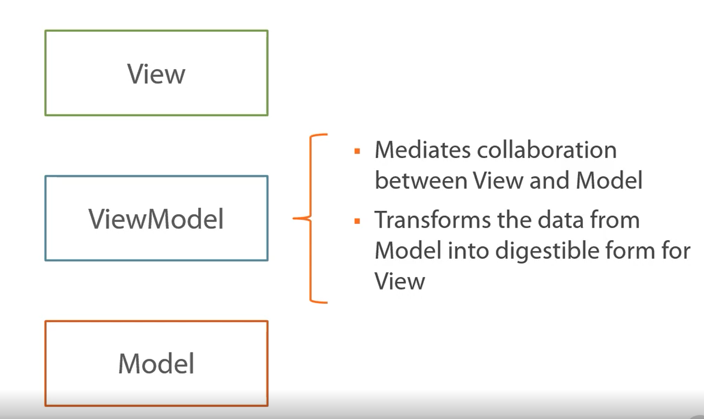
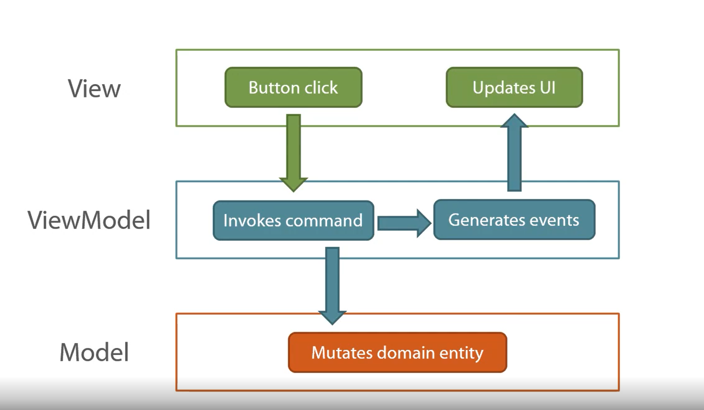

# Domain Drive Design in Practice

- Pluralsight course - https://app.pluralsight.com/library/courses/domain-driven-design-in-practice

### Main Concepts

- `Ubiquitous Language`
    - Language used by all team members to speak about the domain
    - Bridges the gap between developers and experts
    - Code base and database elements should be modeled after domain
- `Bounded Contexts`
    - Create clear boundaries between different parts of the system
- `Core Domain`
    - The problem that the software is meant to solve
    - This is the most important part of the system

### Vocabulary Used

- Problem domain is the problem we're trying to solve with our software - the purpose it is built for
- `Core Domain` is an essential part of the problem domain and cannot be delegated to an external solution and must be created by the developers

- BusinessLogic of application is in 2 inner layers of this
    - `Domain Class` - everything within red square

### DDD is not only about writing code

- Communication between domain experts and developers is key to this process
- Always strive to become a domain expert

### DDD and Unit Testing

- Cover the things in our application those things that are most important
    - Entities
    - Value Objects
    - Domain Events
    - Aggregates
- What about other things like Repositories, Factories and Application Services?
    - Integration tests would probably be better here

### Architecture

### Problem Description

- Model the way a snack machine works with coins and notes
- Insert moneyinto the machine
- Return the money back
- Buy a snack

### Recap

- Always begin your project by modeling your domain model
- Start with a single bounded context to start with
- Always look for hidden abstractions

    - `Product` is defined differently in the different contexts in which it is used
    - This is in contract to having a shared `Product` which has 3 attributes but the 3 attributes aren't always used depending on who is using `Product`

### Entities vs Value Objects

- Main difference in entities and value objects is how we identify them
- Types of equality
    - `Reference equality` - two objects reference the same spot in memory
    - `Identifier equality` - object has an id field
        - Two instances of a class that have id's would be equal if the id fields are equal
    - `Structural equality` - objects are equal if their attributes match

- If we have two $1 bills, it doesn't matter which one we use
- Entities are almost always mutable
- Value objects are immutable
- Value objects shouldn't live on their own

- Money in our context wouldn't make sense without the snack machine, there would be no purpose to it
- Our snack machine contains money in code

- Value objects do not have their own tables in the database

### How to Recognize a Value Object

- Depends on the problem domain
- Something can be an entity in one context but a value object in another
- For example, if you're trying to track money we have in circulation across the country then money should be an entity because we care about each one individually
    - However, in our example, we don't care about $1 bills being unique, so we can make money a value object

 

- If you can safely replace one object with another that has the same set of attributes that's a good sign the thing is a value object
- `Always prefer value objects to entities`
    - Easier to work with
    - `Most of the business logic should go here`
- Entites act as wrappers
- Don't hesitate to refactor entities to value objects if necessary

### Entity Base Class

- Can use an interface but you can't provide default implementation which leads to code duplication
    - This isn't necessarily true anymore with Java interfaces where you can provide some default implementation
- Doesn't show proper relations between entities

- Example base class in C#

#### Value Object Base Class

- Don't have an Id property
- Equality is based on attributes

### When to Write Unit Tests

- Cover the inner most layer - entities, value objects, domain events, and aggregates
- TDD - test first approach
- Test first
    - Know what the code should do
- Code first
    - Experimenting with code
    - Not really sure exactly how things are working or what it should do

## Introducing UI and Persistence Layers

### Adding UI

- MVVM

- ViewModel transforms our model layer into something usable for the View

1. Button Click
1. Invokes Command
1. Mutates Domain Entity
1. Generates events
1. Updates UI

- The view just displays the properties that the ViewModel says to display
    - Also updates those properties when the ViewModel says they changed

## Extending the Bounded Context with Aggregates

### Aggregates

- Gathers multiple entities together under a single abstraction
- Every aggregate has a set of invariants that it's responsible for maintaining
    - Invariants are rules that that aggregate enforces to ensure it's in a valid state
- Classes outside aggregate can only reference the root of the aggregate

- Database should hold all information about aggregates
    - This includes entities
- Value Objects can belong to multiple aggregates
- Entities can belong only to a single aggregate

### How to Find Boundaries for Aggregates

- Why do we have two (Snack and SnackMachine)?
- Depends on the domain model
- Entities inside comprise a cohesive group of classes
    - Does an entity make sense without some other entity?
    - If yes, it potentially should be the root if it's own aggregate
    - Otherwise it should be apart of some existing aggregate
- A slot cannot exist without a snack machine so it needs to be apart of the same aggregate as snack machine
- Boundaries can always be refactored
- Don't create aggregates that are too large
    - The bigger your aggregates are, the harder it is to maintain consistency
    - Simplicity vs Performance
- Most aggregates consist of 1 or 2 entities
- 3 entities per aggregate is usually a max
- Number of Value Objets per aggregate is unlimited

## Other Topics

### Keeping Entities valid

- Is it okay to have entities in an invalid state or should they always be in valid state?

- Note that the `Not Always Valid` approach has a separate `isValid()` method
- Recommendation is to keep with the `always valid` approach
    - Removes temporal coupling
        - You always have to remember to do certain things
    - Helps with DRY
        - Don't have to call `isValid()` all over the place

 

- Where to perform validations?
- Boundary of domain layer in the `application services`

### Factories

- Class that is responsible for creation of domain entities
    - There can be complex creation logic
- Helps simplify entities
- Don't use factories in the case of simple creation logic

### Domain Services vs Application Services

- Domain service
    - No state
    - Contains domain logic
    - Containers for the knowledge that doesn't belong to any entity or value object
    - Inside of domain layer
    - Doesn't communicate with the outside world
    - We don't delegate the work for servicing a car to the car itself - that responsibility goes to a car service
- Application Service
    - Outside of domain layer
    - Communicates with the outside world
    - Doesn't contain domain logic

### Anemic Domain Model Anti-pattern

- Separates data and logic
- Poor encapsulation

### Fat Entities Anti-pattern

- Too much logic in entities
- Opposite of anemic domain model
- How do you know you're doing this?
    - Entities start having unnatural responsibilities
    - Look up data in external sources
    - Communicate with external layers

### Repository Anti-patterns

- Your repository should return a properly intialized entity
- If you want these queries - change the return type

### Mechanical Approach to DDD Anti-pattern

- Bad: having a new concept in the domain model leads to automatic creation of:
    - Entity
    - Repository
    - Factory
    - Domain Service