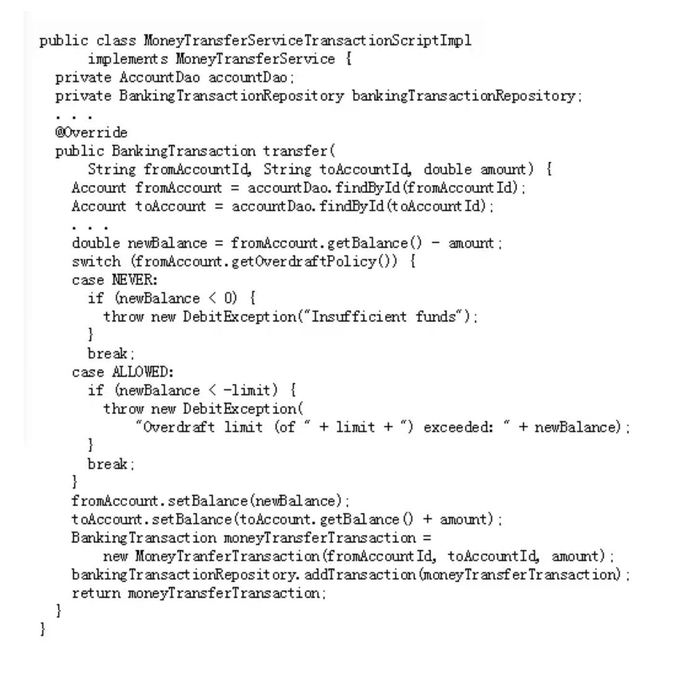
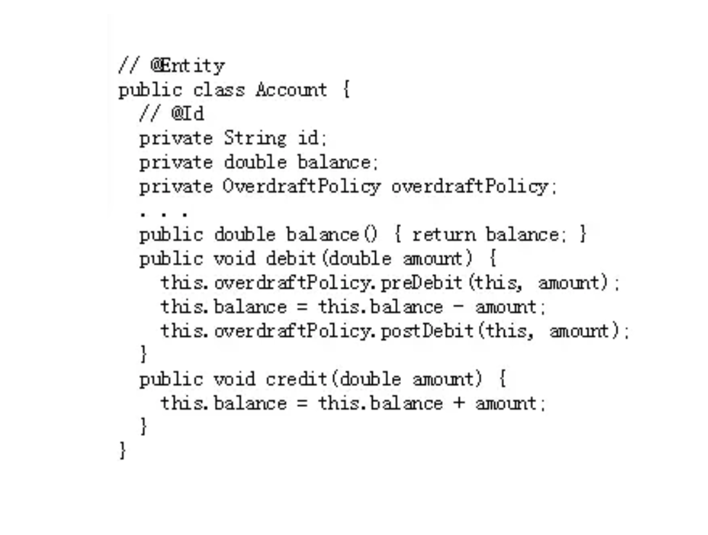
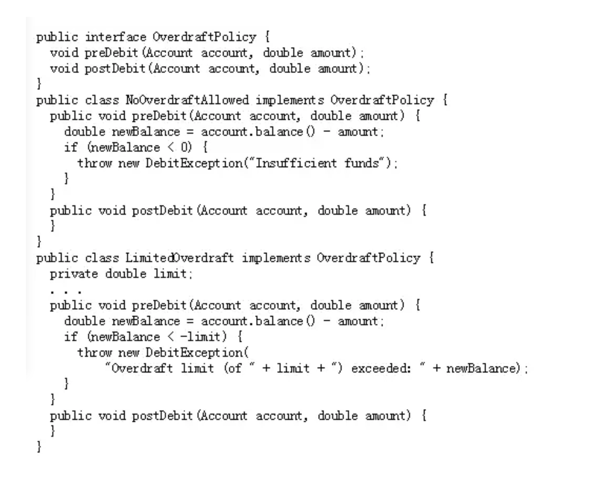
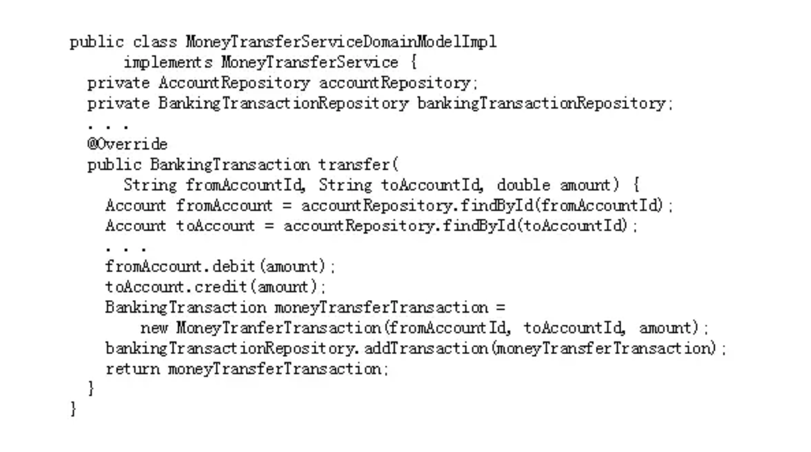
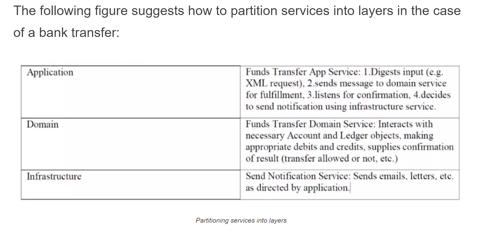

# Making a Case for Domain Modeling

- https://hackernoon.com/making-a-case-for-domain-modeling-17cf47030732

- Two basic approaches
    - domain modeling
        - Taking business knowledge (logic/rules) and modeling them in an OO way
    - transaction script
        - conceives business logic as a series of procedures and subprocedures

 

- No one size fits all solution
    - Domain Modeling can be overly complex for simple applications
    - Transaction Scripts can become a mess for inherently complex business scenarios
        - Tend to get messy when dealing w/ complex scenarios

## Understanding the Benefits of Domain Modeling

- Application can grow with more easily
- Encapsulates business logic more intuitively

### Bank transfer with transaction script

- Business logic of a money transfer between two bank accounts is written in `MoneyTransferService`
- `Account` (a domain object) is only a data structure with getters and setters
    - **anemic domain model**

### Bank transfer using domain modeling

- Allows us to make the business logic much more explicit
- `Account` entity contains both data and behavior

- `OverdraftPolicy` becomes its own object w/ its own business logic

- The domain service (I personally think this might make more sense as an application service) only calls domain objects to complete the business logic

- The DDD refactoring scatters the login the transaction script to 3 defined objects:
    - the domain service
    - the domain entity
    - Overdraftpolicy

## Domain Modeling Basics

- Know your domain
- Start from the basics and elaborate later

### The first iteration: building a simple model

- Building a basic model starts w/ extracting the noun and verbs from the user story to identify key objects, attributes, patterns, and relationships
- Ex: *Tom is looking for a job through an agency and the agency asks him to live his number so he can be informed about any job opportunities*

 

- *Tom* is the jobseeker
- *Phone number* is the jobseeker's attribute
- *Agency* refers to two key objects - the company and its employee
- *Job opportunity* is another key domain object

 

- Consider the relationships among these domain objects
- There is a many-to-many (M2M) relationship between jobseekers and job opportunities
    - A jobseeker can have multiple job opportunities
    - A job opportunity can be applied for by multiple jobseekers
- One-to-many (O2M) relationship between agency and employee, since agency can employ multiple employees

## Domain Services

- Some actions in the domain are verbs, yet they do not belong to any object
- They represent an important action in the domian that can neither be neglected nor incorporated into another entity or value object
    - When this happens, best practice is to declare it as a service
    - Typically named after an activity instead of an entity

- To summarize, to qualify as a domain service a concept must satisfy the following three criteria:
    1. The operation represents a domain concept which does not naturally belong to any entity or value object.
    1. The operation executed involves other objects in the domain.
    1. The operation is stateless.

### Domain Services and the domain layer

- A system generally has 3 main layers
    - application layer
    - domain layer
    - infrastructure layer

